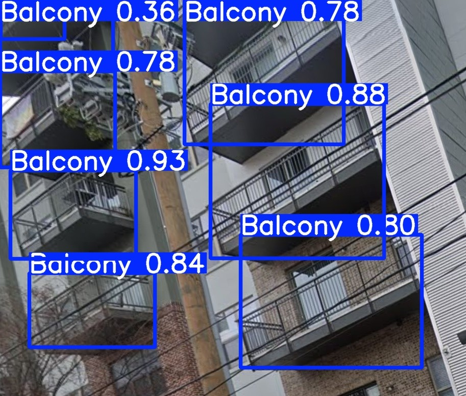
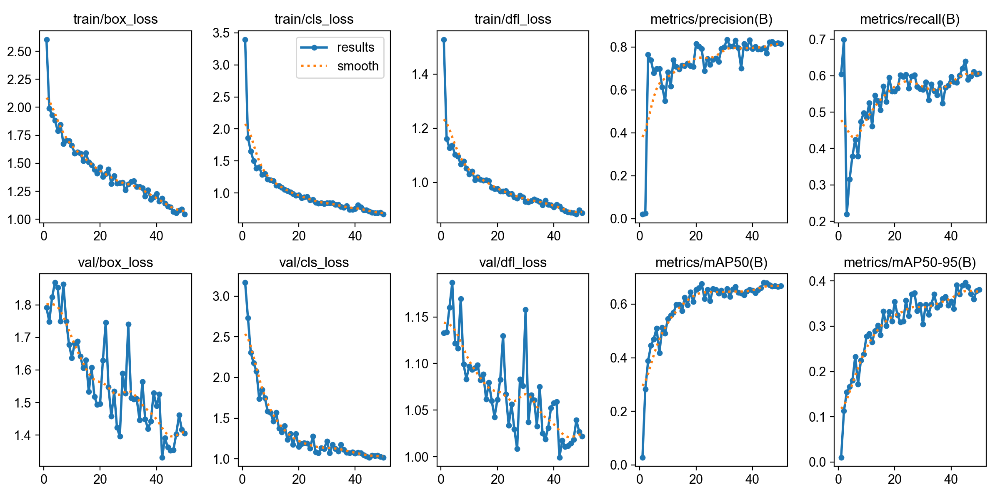
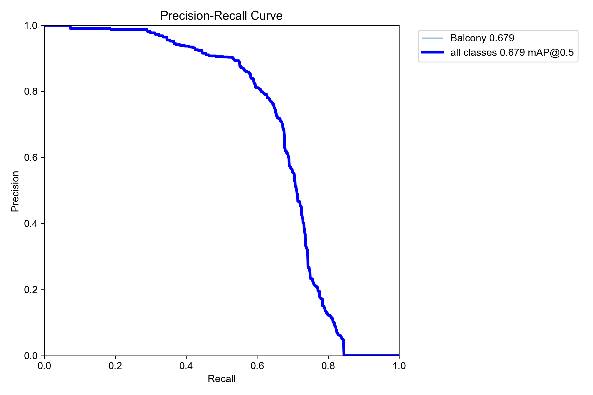
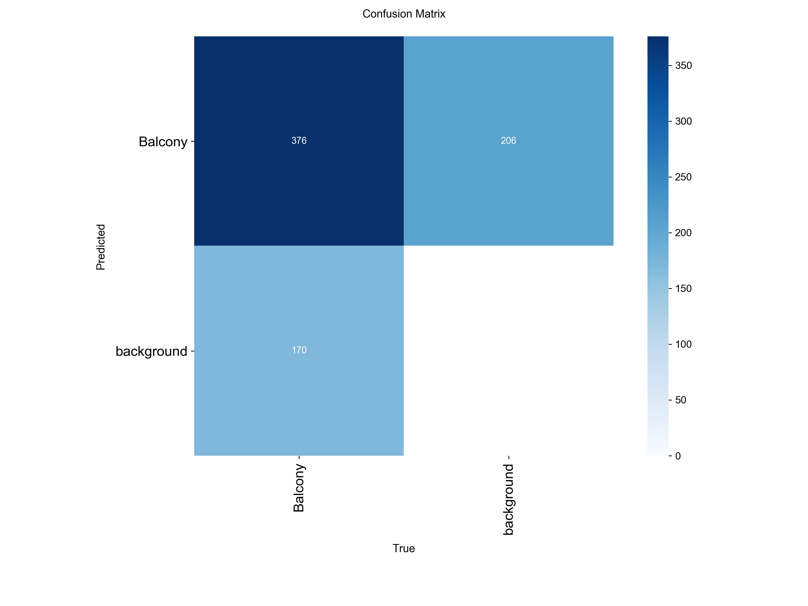
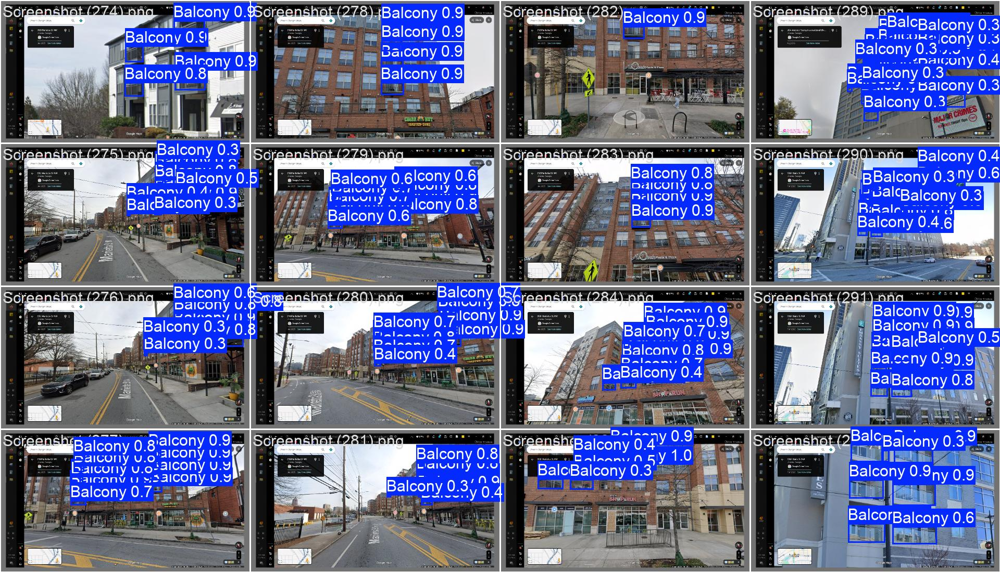

# YOLO Balcony Detector




Lydia Seils
M.S. Architecture (Computational Design) - Georgia Tech 
www.linkedin.com/in/lydia-seils
Lydiamseils@gmail.com
https://lseils.github.io/


--------
## Overview

This Repository includes a Detection Model for Balconies specifically

This is a YOLOv8 trained model with BFA-YOLO architecture


## About

This model was trained for the purpose of being used in other research: A Computational Framework for Assessing Balcony Plug-and-Play Solar Photovoltaic Potential at the Neighborhood Scale

To see this research: https://github.com/SustainableUrbanSystemsLab/ARCH-8833-Lydia


This is a YOLOv8 trained model with BFA-YOLO architeture. BFA-YOLO is a trained model specifically for detection of facade elements. Although there is a balcony class, the dataset and other dependencies are not made available requiring the need for training for balconies with available data that would work for the research. The reason for training YOLOv8 is for its benefits, like it's massive ecosystem, active maintenance, simple API, and easy export options. The value in training the model with BFA-YOLO architecture is it's FBSM (Feature Balanced Spindle Module), TDATH (Target Dynamic Alignment Task Detection Head), and PMESA (Position Memory Enhanced Self-Attention). FBSM handles the fact that balconies vary widley in size across and image. TDATH catches balconies even when part of them is hidden or cut off. PMESA helps the model remember context and position avoiding false positives since non balcony railings can look just like balcony railings. 

To see BFA-YOLO: https://github.com/CVEO/BFA-YOLO

## Usage

To use to detect balconies in your own image follow these steps:

**1. Put your images into input folder**

**2. Ensure correct directories in detection.py**

  - ```python
    import warnings
    warnings.filterwarnings('ignore')
    from ultralytics import YOLO

    if __name__ == '__main__':
        model = YOLO('runs/detect/train3/weights/best.pt') # model.pt path
        model.predict(source='input/images', # input folder
                      imgsz=640,
                      project='detections', # *Directory for output*
                      name='exp',
                      show_labels=True,
                      save=True,
                      # conf=0.2,
                      # visualize=True # visualize model features maps
                    )
    
    ```

**3. Run detection model**
  - To Detect: *(do in venv)*
    ```
    python detect.py
    ```
  
**4. Generated images in detections folder**


## Methods 

**1. Image Collection**

  - Since the use of this model is for a research project uses google   street view images, it was important that the data was at the same type of quality. So the images for training were taken from going around on google maps, finding balconies on buildings, and taking screenshots. In this process, multiple shots of each building were taken so that there would be different FOV, Angles, Lighting, Scale, and portions of the building. Including more variables helps the model to be more robust. 400 images were collected
    

**2. AnyLabeling**

  - AnyLabeling was used to label all of the photos. Polygons were drawn around each balcony. AnyLabeling then output JSON files of the labeled data.

  - To see Label Anything: https://anylabeling.nrl.ai/


**3. Data Conversion**

  - AnyLabeling outputs JSON but traing data requires a specific file type. Bounding boxes were generated around the polygons within the JSON files, then output as txt files which is the correct data type that the model needs to be trained. Labeled images were then put into the different steps of training: 70% train / 20% val / 10% test split

  - To see repo that did this conversion: https://github.com/lseils/AnythingLabeling


**4. Actual Training**

  - Training was conducted using the Ultralytics YOLOv8 framework with the BFA-YOLO architecture defined in yolov8-BFA-YOLO.yaml. The model was trained for a maximum of 200 epochs with an image size of 640px, a batch size of 16, and an initial learning rate of 0.001 using SGD optimization. Training was run on a GPU. YOLOv8's built-in early stopping halted training at epoch 50 when the learning rate decayed to near zero with no further improvement detected. The best performing checkpoint was automatically saved as best.pt based on validation mAP50.
  


## Results


**77.1% Precision** (How good the model is at not "hallucinating" balconies where there are none)

**63.7% Recall** (How good the model is at detecting balconies and not leaving them undetected)

**67.9% mAP50** - Mean Average Precision at 50% IoU (How good the model is at finding the balcony and putting a box roughly in the right spot)

**39.7%** mAP50-95 (How precise and tight the bounding boxes are. Because it demands near-perfect alignment, this number is always significantly lower than mAP50)



*Loss Graphs showing the model learning from it's mistakes and Metrics Graphs going up and starting leveling off showing training for more epochs may not help much more*



*Tradeoff between accuracy and being thorough*



*Number of true positives, false alarms, and missed opportunities*



*Example of detection with bounding boxes and confidence levels*


## Discussion

The results of the model training show that the model leans twords being cautious. When the model makes a prediction, it is usually right but it is currently missing about a third of the objects in the dataset. Missed objects also might be due to being too small or obsured. This shows more epochs (a complete pass of the dataset through an neural network) or better training set is required. val losses are very jagged in the graph suggesting the validation set might be too small or the learning rate is too aggressive for the first pass of training. Another important note is that the results graphs stop at 50 epoch, not 200 like the training was originally set to. Training was actually stopped at 50 because YOLOv8 by default stops if there is no improvment when the learning rate shrinks down to almost zero. More epochs alone will not help this. In the training images, a lot of Goolge street view UI is still included in the images. This may also muddy up the model detection ability. 

With the given results, starting from scratch and retraining the model would yield greater improvements. There is a lot to learn from these results but much of the issues comes down to the lack of precision in the labeling of the balconies. This meaning, more precise outlines of the balconies as well as including every balcony in the picure even if its far way or obscured. Raising the confidence level required in the detect.py file will filter out weak predictions. Images without balconies should be included. Finally, using more images will help with a lot of the issues. 


## Acknowledgement of the use of Artifical Intelligence 

This project was developed with the assistance from Claude (Anthropic) which was used as an AI pair programmer throughout the development process. Claude assisted with debugging, code explanation, understanding model architectureand general guidance on the YOLOv8 training pipeline. Research ideas, gathering data, labeling, and conclusions were all done by the author. 

The author assumes full responsibility for the validity, reproducibility, and integrity of all work presented


## References

Chen, Y., Wang, T., Chen, G., Zhu, K., Tan, X., Wang, J., Guo, W., Wang, Q., Luo, X., & Zhang, X. (2025). BFA-YOLO: A balanced multiscale object detection network for building façade elements detection. Advanced Engineering Informatics, 65, 103289. https://doi.org/10.1016/j.aei.2025.103289

Claude, version (4.6 Sonnet), Anthropic

Kong, G., & Fan, H. (2021). Enhanced Facade Parsing for Street-Level Images Using Convolutional Neural Networks. IEEE Transactions on Geoscience and Remote Sensing, 59(12), 10519–10531. https://doi.org/10.1109/TGRS.2020.3035878

Ultralytics. YOLOv8. Version 8.0, 2023, https://github.com/ultralytics/ultralytics.

X-AnyLabeling. Version 2.5.3, Viet-Anh Nguyen, 2026, https://github.com/vietanhdev/anylabeling.

Zhang, G., Pan, Y., & Zhang, L. (2022). Deep learning for detecting building façade elements from images considering prior knowledge. Automation in Construction, 133, 104016. https://doi.org/10.1016/j.autcon.2021.104016


